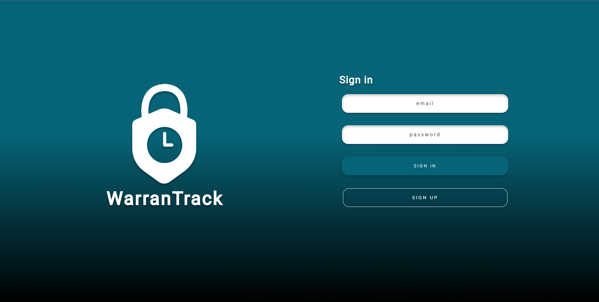
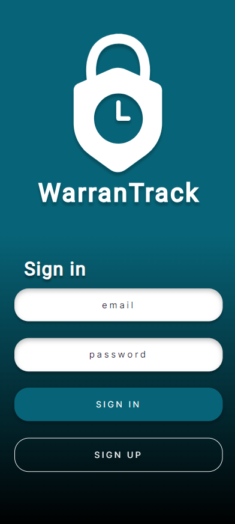
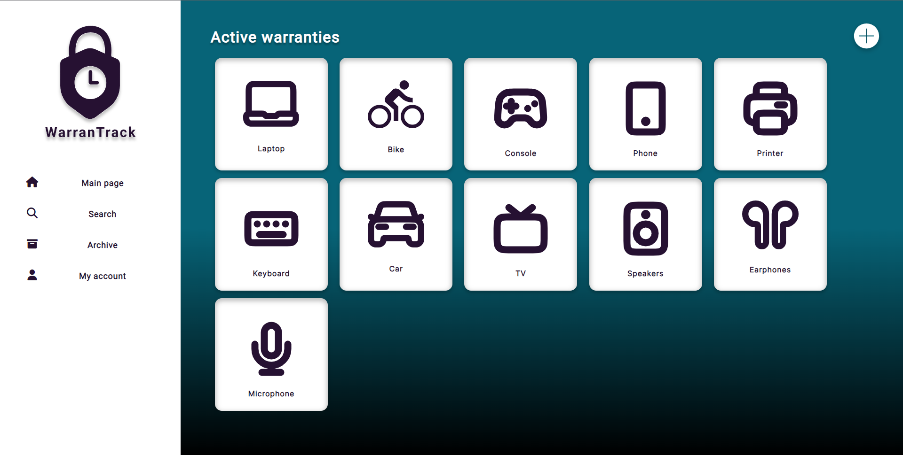
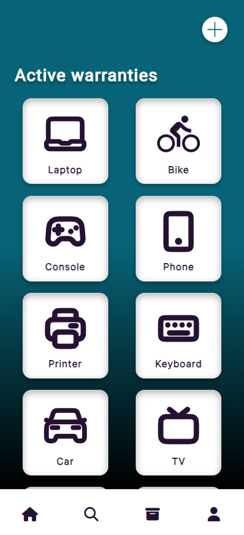
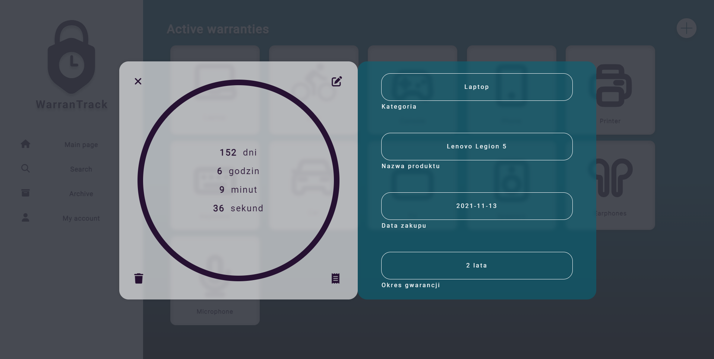
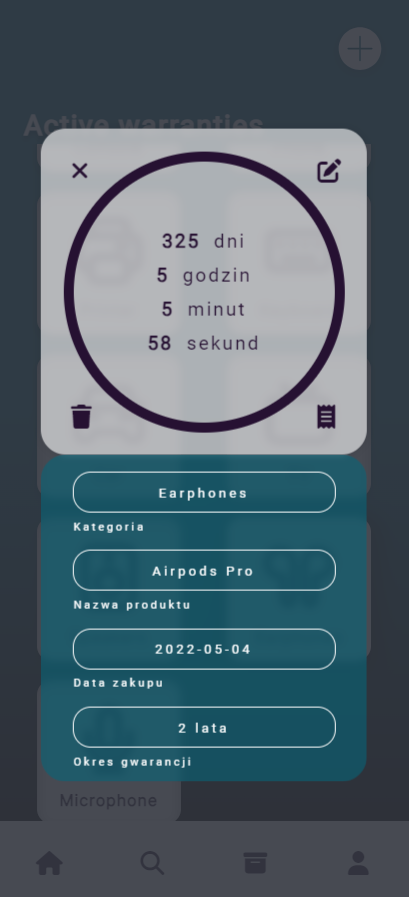
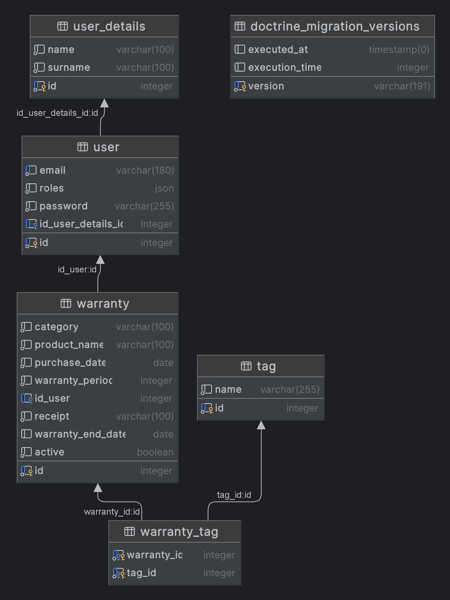
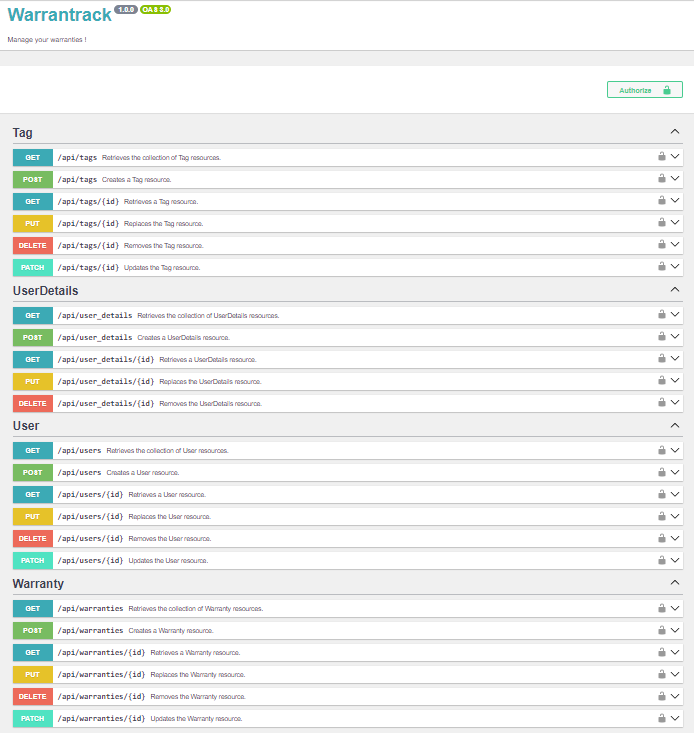

# WarranTrack

The WarranTrack web app makes it easier for users to keep track of their purchases of products that come with a warranty. Whether it's electronics, vehicles, or any other product, WarranTrack helps users stay organized and informed about their warranty periods.

## Features

- Add product information such as product name, category, purchase date, warranty period, and an image of the receipt.
- Automatically calculate and display the remaining time of the warranty for each product.
- Archive warranties when the warranty period ends, providing a clear overview of expired warranties.
- User-friendly interface for managing and viewing products and warranties.
- Responsive design for optimal usage on both mobile and desktop devices.

## Technologies Used

- HTML / Twig
- CSS
- Symfony (PHP)
- JavaScript
- Docker
- PostgreSQL
- Git

## Installation

Make sure the following tools are installed on your system:

- Docker: [Docker Installation Instructions](https://docs.docker.com/get-docker/)
- Docker Compose: [Docker Compose Installation Instructions](https://docs.docker.com/compose/install/)
- PHP: [PHP Installation Instructions](https://www.php.net/manual/en/install.php)
- Composer: [Composer Installation Instructions](https://getcomposer.org/download/)
- Symfony CLI: [Symfony CLI Installation Instructions](https://symfony.com/download)

To install and set up WarranTrack on your local machine, follow these steps:

1. Clone the repository: `git clone https://github.com/Woocash0/WarranTrack`
2. Navigate to the project directory: `cd your-project`
3. Install PHP dependencies: `composer install`
4. Customize the settings in `.env` if necessary:
5. Start the Docker containers: `docker-compose up -d`  

6. Run database migrations: `symfony console doctrine:migrations:migrate`
7. Launch Symfony Application `symfony serve -d`
8. The application should now be accessible at `http://localhost:8000/login`.

## Screenshots

## Entity-Relationship Diagram (ERD)

## API Documentation

## Contributing

Contributions to WarranTrack are currently not open. However, feel free to fork the repository and make any modifications or improvements for personal use.

## License

This project is currently not licensed.

